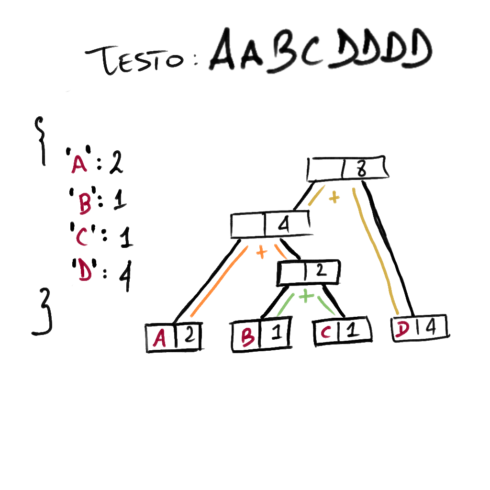

Attività laboratoriale: costruire l'albero di Huffman di un testo
===

Consegna
---

Data la **tabella delle frequenze dei caratteri di un testo** [\[vai alla consegna\]](char-frequency.md), costruire l'albero di Huffman del testo corrispondente.

Albero di Huffman: definizione
---

Un albero di Huffman è un albero binario in cui:
- ogni nodo **non foglia** contiene la somma delle frequenze più piccole del livello sottostante; 
- i nodi foglia, invece, contengono una coppia \\((X, Y)\\) in cui \\(X\\) è un carattere del testo, e \\(Y\\) è la frequenza del carattere nel testo.


Algoritmo (in pseudocodice)
---

```text
Algorithm Build_Huffman_Tree(frequencies):
    // Input: 'frequencies' is a table/map of characters and their counts
    // Output: Returns the root node of the complete Huffman Tree

    // Step 1: Initialize an empty Min-Priority Queue (Q)
    Let Q be a new Min-Priority Queue

    // Step 2: Create a leaf node for each character and insert it into Q
    FOR EACH (char, freq) IN frequencies:
        node = new Node()
        node.character = char
        node.frequency = freq
        node.left = NULL
        node.right = NULL
        
        Insert(Q, node)  // Q orders nodes by node.frequency (lowest first)

    // Step 3: Build the tree from the bottom up
    // We loop until only one merged node (the root) remains in the queue
    WHILE Q.size() > 1:
        
        // Extract the two nodes with the absolute lowest frequencies
        left_node = Extract_Min(Q)
        right_node = Extract_Min(Q)

        // Create a new internal node to act as their parent
        parent_node = new Node()
        parent_node.character = NULL  // Internal nodes don't hold specific characters
        
        // The parent's frequency is the combined sum of its children
        parent_node.frequency = left_node.frequency + right_node.frequency

        // Link the children to the newly created parent
        parent_node.left = left_node
        parent_node.right = right_node

        // Insert this new combined tree back into the priority queue
        Insert(Q, parent_node)

    // Step 4: The last remaining node is the root of the complete tree
    root = Extract_Min(Q)
    
    RETURN root
```

Note: Generato con l'aiuto di Gemini