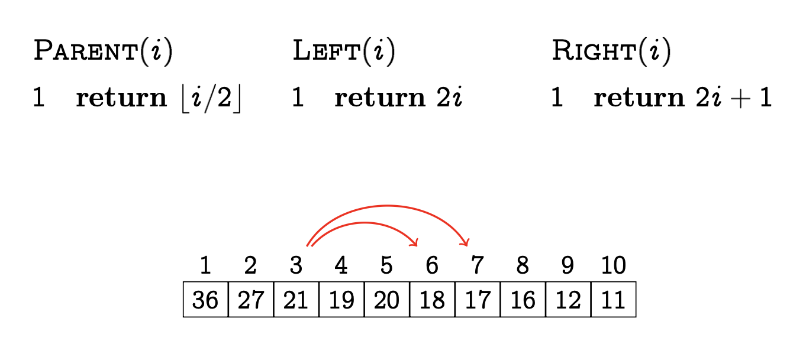
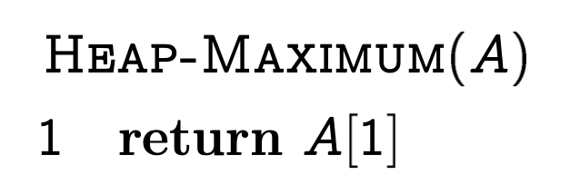
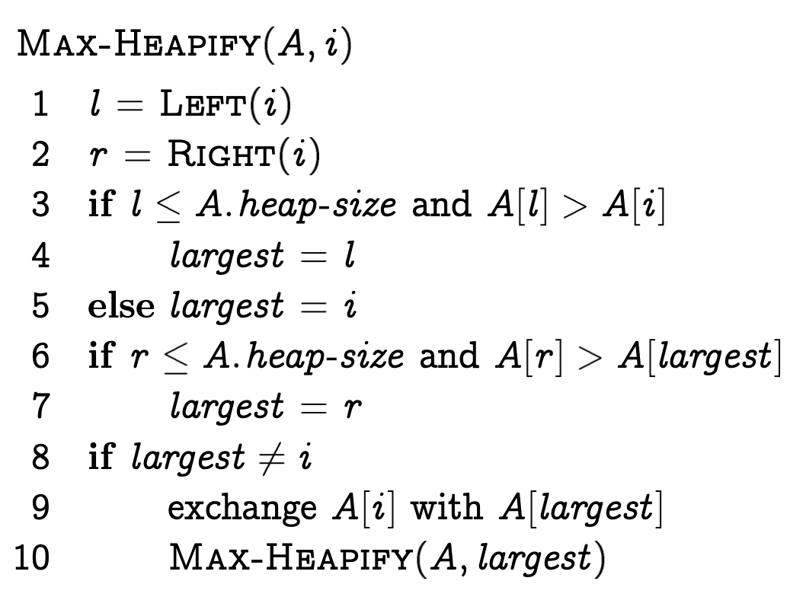
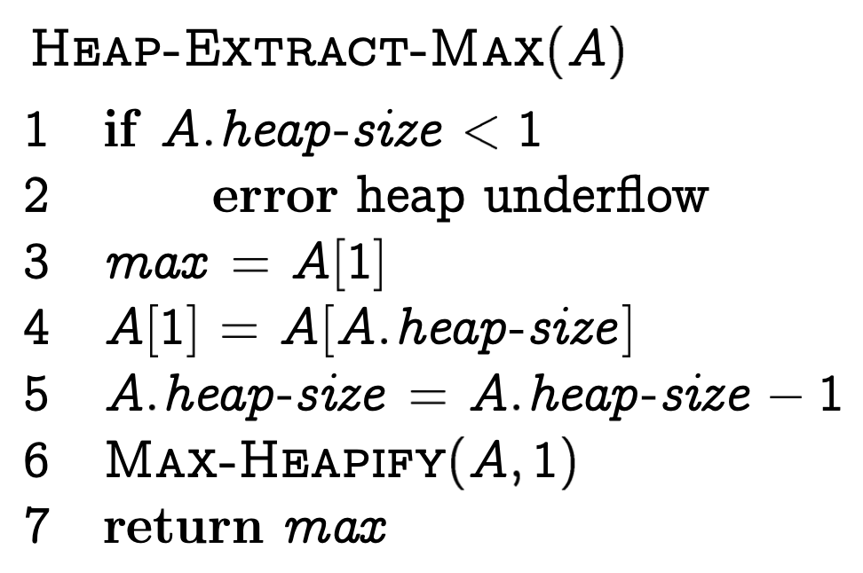
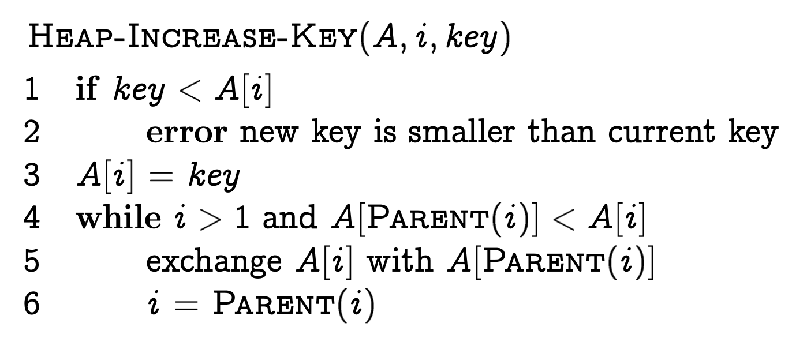
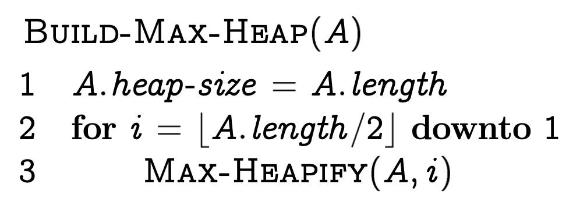

Attività laboratoriale: implementazione di una priority queue mediante MinHeap
===

Consegna
---

Warning: Svolgi i passi in maniera sequenziale!

### Parte #01

Scrivi un programma in C# che implementi, tramite la scrittura di una classe, la struttura dati MinHeap che memorizza un numero variabile \\(n \in \mathbb{N} \\) di chiavi \\( k \in \mathbb{N}\\), con tutte le operazioni previste per tale struttura dati. 

Hint: Puoi riguardare gli pseudocodici delle operazioni previste per **MaxHeap** dalle dispense condivise (o dagli allegati della consegna) e cercare di capire la logica da seguire per **MinHeap**.

### Parte #02

Abbiamo visto che possiamo realizzare una priority queue mediante Heap, raggiungendo un compromesso (in termini di complessità computazionale) tra una sua realizzazione basata su **vettore ordinato** e una su **vettore disordinato**. Realizza, in C#, una classe "`MinPriorityQueue`" in cui deve essere possibile:

1. Accodare un elemento (`Enqueue()`)
2. Servire l'elemento con priorità minore (`Dequeue()`)
3. Sapere quanti elementi sono in coda (`ElementsLeft`)

Allegati
---

Note: Ricorda che in pseudocodice gli array iniziano da 1!

